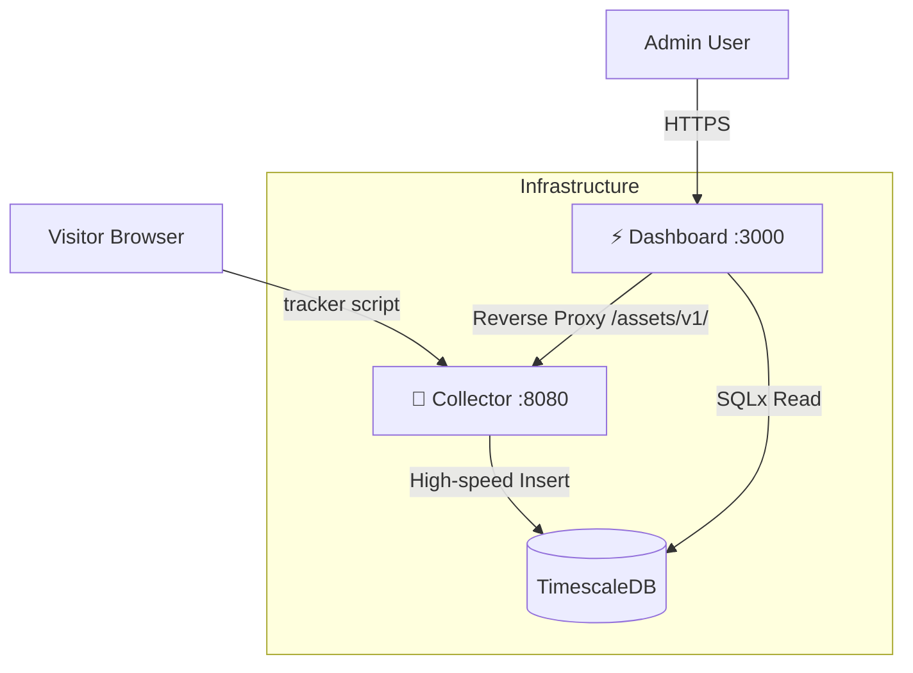

# 📊 OSLKS Radar

[](https://opensource.org/licenses/MIT)
[](https://www.rust-lang.org/)
[](https://www.docker.com/)

**OSLKS Radar** is a high-performance, privacy-friendly web analytics platform. It combines a lightweight Rust/Axum **event collector** for high-throughput telemetry ingestion with a **React SPA dashboard** for real-time visualization.

> **Design Philosophy:** Built for extreme performance, low resource usage (ARM/Ampere compatible), and simplicity.

---

## 🚀 Features

- **Ultra-fast Ingestion** — Rust/Axum collector with O(1) origin validation via in-memory domain cache.
- **Futuristic Dashboard** — High-end UI with glassmorphism, neon accents, and dark-mode optimization.
- **PWA & Mobile Ready** — Fully responsive design with Progressive Web App support for home-screen installation.
- **Privacy First** — Self-hostable, no cookies, no third-party tracking, GDPR-friendly.
- **Easy Setup** — Built-in Installation Wizard for first-time configuration.
- **ARM Optimized** — Native support for ARM architecture (Oracle Cloud Ampere, etc.).
- **Time-Series Optimized** — Powered by TimescaleDB for efficient data retention and querying.
- **Ad-Blocker Resilient** — Stealth mode routes (`/assets/v1/`) disguise tracking as first-party assets.

---

## 🏗 Architecture



| Component | Technology | Default Port |
|:---|:---|:---|
| **Collector** (Backend) | Rust, Axum, SQLx, Moka cache | `8080` |
| **Dashboard** (Frontend) | React, TypeScript, Vite, Shadcn UI, Caddy | `3000` |
| **Database** | TimescaleDB (PostgreSQL 16) | `5432` |

---

## 📡 Integrating the Tracker into Your Website

Add the tracking script to the `<head>` of every page you want to track.

### Option A: Direct (simplest)

Point directly at the collector backend:

```html
<script src="https://telemetry.example.com/lib/j"
        data-website-id="YOUR_WEBSITE_ID"
        data-host-url="https://telemetry.example.com">
</script>
```

For example, with a collector at `telemetry.example.com`:

```html
<script src="https://telemetry.example.com/lib/j"
        data-website-id="550e8400-e29b-41d4-a716-446655440000"
        data-host-url="https://telemetry.example.com">
</script>
```

### Option B: Stealth Mode (ad-blocker resistant)

Load the script from a same-origin path to avoid ad blockers. The collector supports `/assets/v1/` prefixed routes natively:

```html
<script src="https://YOUR_COLLECTOR_URL/assets/v1/lib/j"
        data-website-id="YOUR_WEBSITE_ID"
        data-host-url="https://YOUR_COLLECTOR_URL/assets/v1">
</script>
```

For **even more stealth**, proxy through your own domain using rewrites:

<details>
<summary><strong>Next.js</strong> — <code>next.config.ts</code></summary>

```js
async rewrites() {
    return [
        {
            source: "/assets/v1/:path*",
            destination: "https://YOUR_COLLECTOR_URL/:path*",
        },
    ];
}
```

Then use your own domain in the script tag:

```html
<script src="/assets/v1/lib/j"
        data-website-id="YOUR_WEBSITE_ID"
        data-host-url="/assets/v1">
</script>
```

</details>

<details>
<summary><strong>Nginx</strong></summary>

```nginx
location /assets/v1/ {
    proxy_pass https://YOUR_COLLECTOR_URL/;
    proxy_set_header Host $host;
    proxy_set_header X-Real-IP $remote_addr;
    proxy_set_header X-Forwarded-For $proxy_add_x_forwarded_for;
}
```

</details>

<details>
<summary><strong>Cloudflare Workers</strong></summary>

```js
export default {
    async fetch(request) {
        const url = new URL(request.url);
        if (url.pathname.startsWith('/assets/v1/')) {
            const target = 'https://YOUR_COLLECTOR_URL' + url.pathname.replace('/assets/v1', '');
            return fetch(target, request);
        }
        return fetch(request);
    }
};
```

</details>

### How it works

The tracker script (`<1KB`) automatically tracks:

- **Pageviews** — on page load
- **SPA navigation** — via `history.pushState` / `replaceState` / `popstate`

Events are sent via `sendBeacon` (preferred) or `fetch` with `keepalive`.

| Attribute | Required | Description |
|:---|:---|:---|
| `data-website-id` | ✅ | UUID of the website (from the Dashboard) |
| `data-host-url` | ❌ | Override the collector URL (defaults to script origin) |

---

## 🐳 Installing with Docker

The easiest way to get started is using Docker Compose.

### Pull Docker images

```bash
# Pull the latest images from the self-hosted Gitea registry
docker pull git.slks.cz/oslks/oslks-collector:latest
docker pull git.slks.cz/oslks/oslks-frontend:latest
```

### Docker Compose

Run the entire stack (Collector, Dashboard, and TimescaleDB) with one command:

```bash
docker compose up -d --build
```

### Prerequisites

- **Docker & Docker Compose** (version 2.0+)
- **MaxMind GeoIP Database** (optional, place `GeoLite2-City.mmdb` in `backend/src/data/`)

---

## 🛠️ Getting Started (Local Development)

### 1. Clone the repository

```bash
git clone https://github.com/ondrasalek/oslks-telemetry.git
cd oslks-telemetry
```

### 2. Environment Setup

```bash
cp .env.example .env
# Edit .env with your values
```

Key variables:

| Variable | Required | Default | Description |
|:---|:---|:---|:---|
| `DATABASE_URL` | ✅ | — | PostgreSQL connection string |
| `SESSION_SECRET` | ✅ | — | Random secret for session cookies |
| `CORS_ALLOWED_ORIGINS` | ❌ | `*` (mirror) | Comma-separated allowed origins |
| `GEOIP_DB_PATH` | ❌ | — | Path to MaxMind GeoLite2-City.mmdb |
| `VITE_APP_URL` | ❌ | `http://localhost:5173` | Public Dashboard URL (Required for exact tracker script generation in production, e.g. `https://radar.example.com`) |
| `VITE_OSLKS_COLLECTOR_URL` | ❌ | — | Self-tracking: URL of the collector to send dashboard's own analytics to |
| `VITE_OSLKS_WEBSITE_ID` | ❌ | — | Self-tracking: Website UUID from the dashboard for tracking dashboard usage |

### 3. Run with Docker Compose

```bash
docker compose up -d --build
```

### 4. Initial Setup

1. Navigate to `http://localhost:3000/install`
2. Follow the Installation Wizard to create your Superuser account
3. Add your first website and copy the tracking snippet

### 5. Access the App

| Service | URL |
|:---|:---|
| Dashboard | [http://localhost:3000](http://localhost:3000) |
| Collector health | [http://localhost:8080/health](http://localhost:8080/health) |
| Installation Wizard | [http://localhost:3000/install](http://localhost:3000/install) |

---

## 📦 Project Structure

```text
.
├── backend/                # Rust Collector + Dashboard API (Axum)
│   ├── src/
│   │   ├── api/            # HTTP handlers (auth, analytics, websites, teams, settings)
│   │   ├── auth/           # Session middleware & permissions engine
│   │   ├── tracker/        # Tracking script (script.js)
│   │   ├── db/             # Models & database helpers
│   │   ├── domain_cache.rs # In-memory origin validation cache
│   │   └── main.rs         # Server entry point
│   ├── migrations/         # SQLx database migrations
│   └── Dockerfile
├── frontend-react/         # React SPA Dashboard
│   ├── src/
│   │   ├── pages/          # Route pages (dashboard, sites, admin, terms, privacy)
│   │   ├── components/     # UI + layout components (Shadcn UI)
│   │   ├── hooks/          # TanStack Query data fetching hooks
│   │   ├── lib/            # API client, utilities
│   │   ├── types/          # TypeScript API interfaces
│   │   └── App.tsx         # Router + providers
│   ├── Caddyfile           # Production Caddy config (SPA + API proxy)
│   └── Dockerfile          # Node build → Caddy runtime
├── docker-compose.yml      # Full-stack orchestration
├── .env.example            # Environment template
└── README.md
```

---

## 🚢 Deployment

### Deploying via Docker Compose (Coolify, VPS, etc.)

The project uses a single, flexible `docker-compose.yml` for both local development and production deployment.

1. **Configure environment variables**:
    - Ensure `VITE_APP_URL` is set to your public domain (e.g., `https://radar.example.com`).
    - Set a strong `SESSION_SECRET`.
    - If using an external database (e.g., Coolify managed DB), you can remove the `db` service from the compose file or simply provide the external `DATABASE_URL`.

2. **Deployment Platforms (Like Coolify)**:
    - Import the repository.
    - Coolify will automatically pick up `docker-compose.yml`.
    - Set all required variables in the Coolify UI.

#### Environment Configuration Summary

| Service | Key Variables |
| :--- | :--- |
| **Backend** | `DATABASE_URL`, `SESSION_SECRET`, `SMTP_*` |
| **Frontend** | `VITE_APP_URL`, `COLLECTOR_INTERNAL_URL` |

---

## 📋 Dashboard Features

### Website Management

- **Add / Edit / Delete** websites with domain and friendly name
- **Pin favorites** — pinned sites appear first in the list
- **Public share links** — generate a `share_id` for read-only public analytics
- **Transfer between teams** — move a website and its data to another team
- **Reset analytics data** — wipe all events for a website

### Administration (Superuser)

- **User management** — view, edit roles, and delete users
- **Team management** — overview of all teams and members
- **SMTP configuration** — set up outgoing email with host, port, credentials
- **Test email** — send a test notification to verify SMTP settings
- **API keys** — generate and revoke tokens for external integrations

---

## 🤝 Contributing

1. Fork the repository
2. Create a feature branch (`git checkout -b feature/amazing-feature`)
3. Commit your changes
4. Push to the branch
5. Open a Pull Request

---

## 📄 License

Distributed under the MIT License. See `LICENSE` for more information.
