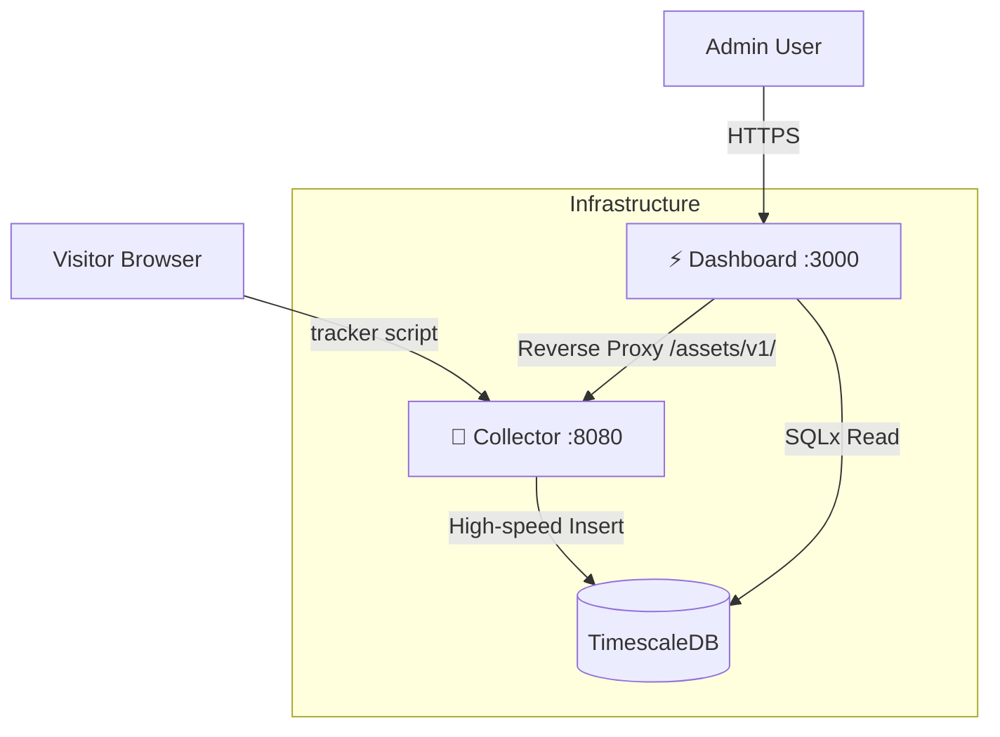

# 📊 OSLKS Radar

[](https://opensource.org/licenses/MIT)
[](https://www.rust-lang.org/)
[](https://www.docker.com/)

**OSLKS Radar** is a high-performance, privacy-friendly web analytics platform. It combines a lightweight Rust/Axum **event collector** for high-throughput telemetry ingestion with a **React SPA dashboard** for real-time visualization.

> **Design Philosophy:** Built for extreme performance, low resource usage (ARM/Ampere compatible), and simplicity.

---

## 🚀 Features

- **Ultra-fast Ingestion** — Rust/Axum collector with O(1) origin validation via in-memory domain cache.
- **Futuristic Dashboard** — High-end UI with glassmorphism, neon accents, and dark-mode optimization.
- **PWA & Mobile Ready** — Fully responsive design with Progressive Web App support for home-screen installation.
- **Privacy First** — Self-hostable, no cookies, no third-party tracking, GDPR-friendly.
- **Easy Setup** — Built-in Installation Wizard for first-time configuration.
- **ARM Optimized** — Native support for ARM architecture (Oracle Cloud Ampere, etc.).
- **Time-Series Optimized** — Powered by TimescaleDB for efficient data retention and querying.
- **Ad-Blocker Resilient** — Stealth mode routes (`/assets/v1/`) disguise tracking as first-party assets.

---

## 🏗 Architecture


```mermaid
graph TD
    Visitor[Visitor Browser] -- "tracker script" --> Collector[🦀 Collector :8080]
    Admin[Admin User] -- "HTTPS" --> Dashboard[⚡ Dashboard :3000]

    subgraph Infrastructure
        Collector -- "High-speed Insert" --> DB[(TimescaleDB)]
        Dashboard -- "SQLx Read" --> DB
        Dashboard -- "Reverse Proxy /assets/v1/" --> Collector
    end
```

| Component | Technology | Default Port |
|:---|:---|:---|
| **Collector** (Backend) | Rust, Axum, SQLx, Moka cache | `8080` |
| **Dashboard** (Frontend) | React, TypeScript, Vite, Shadcn UI, Caddy | `3000` |
| **Database** | TimescaleDB (PostgreSQL 16) | `5432` |

---

## 📡 Integrating the Tracker into Your Website

Add the tracking script to the `<head>` of every page you want to track.

> Automating this with an AI agent? Point it at
> [`docs/AGENT-RUNBOOK.md`](docs/AGENT-RUNBOOK.md) — a step-by-step procedure for
> registering a site via the API, whitelisting its origin, installing the
> snippet, and verifying that hits actually land.

### Option A: Direct (simplest)

Point directly at the collector backend:

```html
<script src="https://telemetry.example.com/lib/j"
        data-website-id="YOUR_WEBSITE_ID"
        data-host-url="https://telemetry.example.com">
</script>
```

For example, with a collector at `telemetry.example.com`:

```html
<script src="https://telemetry.example.com/lib/j"
        data-website-id="550e8400-e29b-41d4-a716-446655440000"
        data-host-url="https://telemetry.example.com">
</script>
```

### Option B: Stealth Mode (ad-blocker resistant)

Load the script from a same-origin path to avoid ad blockers. The collector supports `/assets/v1/` prefixed routes natively:

```html
<script src="https://YOUR_COLLECTOR_URL/assets/v1/lib/j"
        data-website-id="YOUR_WEBSITE_ID"
        data-host-url="https://YOUR_COLLECTOR_URL/assets/v1">
</script>
```

For **even more stealth**, proxy through your own domain using rewrites:

<details>
<summary><strong>Next.js</strong> — <code>next.config.ts</code></summary>

```js
async rewrites() {
    return [
        {
            source: "/assets/v1/:path*",
            destination: "https://YOUR_COLLECTOR_URL/:path*",
        },
    ];
}
```

Then use your own domain in the script tag:

```html
<script src="/assets/v1/lib/j"
        data-website-id="YOUR_WEBSITE_ID"
        data-host-url="/assets/v1">
</script>
```

</details>

<details>
<summary><strong>Nginx</strong></summary>

```nginx
location /assets/v1/ {
    proxy_pass https://YOUR_COLLECTOR_URL/;
    proxy_set_header Host $host;
    proxy_set_header X-Real-IP $remote_addr;
    proxy_set_header X-Forwarded-For $proxy_add_x_forwarded_for;
}
```

</details>

<details>
<summary><strong>Cloudflare Workers</strong></summary>

```js
export default {
    async fetch(request) {
        const url = new URL(request.url);
        if (url.pathname.startsWith('/assets/v1/')) {
            const target = 'https://YOUR_COLLECTOR_URL' + url.pathname.replace('/assets/v1', '');
            return fetch(target, request);
        }
        return fetch(request);
    }
};
```

</details>

### How it works

The tracker script (`<1KB`) automatically tracks:

- **Pageviews** — on page load
- **SPA navigation** — via `history.pushState` / `replaceState` / `popstate`

Events are sent via `sendBeacon` (preferred) or `fetch` with `keepalive`.

| Attribute | Required | Description |
|:---|:---|:---|
| `data-website-id` | ✅ | UUID of the website (from the Dashboard) |
| `data-host-url` | ✅ | Base URL of the collector. The tracker posts to `<data-host-url>/v1/p` |

> **`data-host-url` is effectively required.** Without it the tracker falls back to
> the script's *directory* — `…/lib/j` becomes `…/lib`, so hits are posted to
> `/lib/v1/p`, which does not exist and returns 404. Always set it explicitly.

### ⚠️ Whitelist the tracked site's origin

The collector runs CORS in **whitelist mode**. Hits are posted as
`application/json`, which triggers a CORS preflight, so a site whose origin is
missing from `CORS_ALLOWED_ORIGINS` is **silently dropped by the browser** — no
server-side error, no events, nothing in the logs.

Every tracked domain must be added to `CORS_ALLOWED_ORIGINS` (comma-separated),
and the app redeployed:

```bash
CORS_ALLOWED_ORIGINS=https://radar.example.com,https://site-one.com,https://site-two.com
```

Verify a site is whitelisted — the response **must** contain
`access-control-allow-origin`:

```bash
curl -si -X OPTIONS https://YOUR_COLLECTOR_URL/v1/p \
     -H 'Origin: https://site-one.com' \
     -H 'Access-Control-Request-Method: POST' \
     -H 'Access-Control-Request-Headers: content-type' | grep -i access-control-allow-origin
```

---

## 🐳 Installing with Docker

The easiest way to get started is using Docker Compose.

### Pull the Docker image

The collector, dashboard API and SPA ship as a **single image**, supervised by
s6-overlay:

```bash
# Pull the latest image from the self-hosted Gitea registry
docker pull git.slks.cz/oslks/oslks-radar:latest
```

| Process         | Port   | Role                                        |
| --------------- | ------ | ------------------------------------------- |
| `collector`     | `8080` | Rust ingest endpoint — also runs migrations  |
| `dashboard-api` | `8081` | Node dashboard API                          |
| `caddy`         | `80`   | Serves the SPA and proxies to the other two — the only exposed port |

Startup order is enforced inside the container: the collector applies the
database migrations first, and the dashboard API waits for it to report healthy
before starting. If any of the three processes dies, the container halts so the
restart policy brings the whole thing back cleanly.

### Docker Compose

Run the entire stack (app + TimescaleDB) with one command:

```bash
docker compose up -d
```

To pin a specific build instead of `latest`, set `IMAGE_TAG` to a commit SHA in
your `.env`:

```bash
IMAGE_TAG=5547666...
```

### Prerequisites

- **Docker & Docker Compose** (version 2.0+)
- **MaxMind GeoIP Database** (optional, place `GeoLite2-City.mmdb` in `backend/src/data/`)

---

## 🛠️ Getting Started (Local Development)

### 1. Clone the repository

```bash
git clone https://github.com/ondrasalek/oslks-telemetry.git
cd oslks-telemetry
```

### 2. Environment Setup

```bash
cp .env.example .env
# Edit .env with your values
```

Key variables:

| Variable | Required | Default | Description |
|:---|:---|:---|:---|
| `DATABASE_URL` | ✅ | — | PostgreSQL connection string |
| `SESSION_SECRET` | ✅ | — | Random secret for session cookies |
| `CORS_ALLOWED_ORIGINS` | ❌ | `*` (mirror) | Comma-separated allowed origins |
| `GEOIP_DB_PATH` | ❌ | — | Path to MaxMind GeoLite2-City.mmdb |
| `VITE_APP_URL` | ❌ | `http://localhost:5173` | Public Dashboard URL (Required for exact tracker script generation in production, e.g. `https://radar.example.com`) |
| `VITE_OSLKS_COLLECTOR_URL` | ❌ | — | Self-tracking: URL of the collector to send dashboard's own analytics to |
| `VITE_OSLKS_WEBSITE_ID` | ❌ | — | Self-tracking: Website UUID from the dashboard for tracking dashboard usage |

### 3. Run with Docker Compose

```bash
docker compose up -d --build
```

### 4. Initial Setup

1. Navigate to `http://localhost:3000/install`
2. Follow the Installation Wizard to create your Superuser account
3. Add your first website and copy the tracking snippet

### 5. Access the App

| Service | URL |
|:---|:---|
| Dashboard | [http://localhost:3000](http://localhost:3000) |
| Collector health | [http://localhost:8080/health](http://localhost:8080/health) |
| Installation Wizard | [http://localhost:3000/install](http://localhost:3000/install) |

---

## 📦 Project Structure

```text
.
├── backend/                # Rust Collector + Dashboard API (Axum)
│   ├── src/
│   │   ├── api/            # HTTP handlers (auth, analytics, websites, teams, settings)
│   │   ├── auth/           # Session middleware & permissions engine
│   │   ├── tracker/        # Tracking script (script.js)
│   │   ├── db/             # Models & database helpers
│   │   ├── domain_cache.rs # In-memory origin validation cache
│   │   └── main.rs         # Server entry point
│   ├── migrations/         # SQLx database migrations
│   └── Dockerfile
├── frontend-react/         # React SPA Dashboard
│   ├── src/
│   │   ├── pages/          # Route pages (dashboard, sites, admin, terms, privacy)
│   │   ├── components/     # UI + layout components (Shadcn UI)
│   │   ├── hooks/          # TanStack Query data fetching hooks
│   │   ├── lib/            # API client, utilities
│   │   ├── types/          # TypeScript API interfaces
│   │   └── App.tsx         # Router + providers
│   ├── Caddyfile           # Caddy config for the standalone frontend image
│   └── Dockerfile          # Node build → Caddy runtime
├── dashboard-api/          # Node/Express dashboard API
│   ├── src/
│   │   ├── controllers/    # Route handlers (auth, websites, analytics, api keys)
│   │   ├── routes/         # Express routers
│   │   ├── middleware/     # API-key authentication and scoping
│   │   └── lib/            # DB client, key generation/hashing
│   └── Dockerfile
├── docker/                 # Combined-image assets
│   ├── Caddyfile           # Proxies to sibling processes on localhost
│   ├── s6/                 # s6-overlay service definitions
│   └── scripts/            # Startup ordering helpers
├── Dockerfile              # Combined image (collector + API + SPA)
├── docker-compose.yml      # Full-stack orchestration
├── .env.example            # Environment template
└── README.md
```

The per-service Dockerfiles are kept for local development and for running any
component on its own; production deploys use the combined image at the root.

---

## 🚢 Deployment

### Deploying via Docker Compose (Coolify, VPS, etc.)

The project uses a single, flexible `docker-compose.yml` for both local development and production deployment.

1. **Configure environment variables**:
    - Ensure `VITE_APP_URL` is set to your public domain (e.g., `https://radar.example.com`).
    - Set a strong `SESSION_SECRET`.
    - If using an external database (e.g., Coolify managed DB), you can remove the `db` service from the compose file or simply provide the external `DATABASE_URL`.

2. **Deployment Platforms (Like Coolify)**:
    - Import the repository.
    - Coolify will automatically pick up `docker-compose.yml`.
    - Set all required variables in the Coolify UI.

#### Environment Configuration Summary

| Service | Key Variables |
| :--- | :--- |
| **app** | `DATABASE_URL`, `SESSION_SECRET`, `CORS_ALLOWED_ORIGINS`, `GEOIP_DB_PATH`, `SMTP_*`, `IMAGE_TAG` |
| **db** | `POSTGRES_DB`, `POSTGRES_USER`, `POSTGRES_PASSWORD` |

> **Do not set `PORT` on the `app` service.** The collector and the dashboard
> API both read it, and each supervised process assigns its own (8080 / 8081).

The `VITE_*` variables are **build-time** arguments baked into the SPA bundle,
not runtime environment variables — they are set as build args in the CI
workflow, not in `.env`.

---

## 📋 Dashboard Features

### Website Management

- **Add / Edit / Delete** websites with domain and friendly name
- **Pin favorites** — pinned sites appear first in the list
- **Public share links** — generate a `share_id` for read-only public analytics
- **Transfer between teams** — move a website and its data to another team
- **Reset analytics data** — wipe all events for a website

### Administration (Superuser)

- **User management** — view, edit roles, and delete users
- **Team management** — overview of all teams and members
- **SMTP configuration** — set up outgoing email with host, port, credentials
- **Test email** — send a test notification to verify SMTP settings

---

## 🔑 API Keys (server-to-server)

External services (a CMS, a deploy script, a cron job) can call the dashboard
API without a browser session. Create a key under **Settings → API Keys**; the
secret is shown **once**, at creation time — only its SHA-256 hash is stored.

Present it on every request:

```bash
curl -H "Authorization: Bearer oslks_<prefix>_<secret>" \
     https://radar.slks.cz/api/websites
```

`X-Api-Key: <key>` is accepted as an alternative header.

### Creating a website programmatically

```bash
curl -X POST https://radar.slks.cz/api/websites \
     -H "Authorization: Bearer $OSLKS_API_KEY" \
     -H "Content-Type: application/json" \
     -d '{"name":"Marketing site","domain":"example.com"}'
```

Returns `201` with the created row, including its UUID `id` — the value the
tracker snippet needs as its website ID.

| Status | Meaning                                       |
| ------ | --------------------------------------------- |
| `201`  | Created                                       |
| `400`  | `domain` missing                              |
| `401`  | Key missing, malformed, unknown, or revoked   |
| `403`  | Endpoint not available to API keys, or a team the key isn't scoped to |
| `409`  | A website with that domain already exists     |

### Scope

A key acts as its creator, confined to **one team**. It reaches only:

| Method | Endpoint                                                    |
| ------ | ----------------------------------------------------------- |
| `GET`  | `/api/websites`, `/api/websites/:id`, `/api/websites/team/:team_id` |
| `POST` | `/api/websites`                                             |
| `GET`  | `/api/analytics/:website_id/{stats,metrics,chart,active}`   |
| `GET`  | `/api/analytics/team/:team_id/stats`                        |

Everything else — user and team administration, instance settings, and API-key
management itself — is session-only. Keys cannot mint or revoke keys.

### Managing keys

| Method   | Endpoint             | Description                              |
| -------- | -------------------- | ---------------------------------------- |
| `GET`    | `/api/api-keys`      | List your active keys (prefix only)      |
| `POST`   | `/api/api-keys`      | Create a key — returns the secret once   |
| `DELETE` | `/api/api-keys/:id`  | Revoke a key, effective immediately      |

---

## 🤝 Contributing

1. Fork the repository
2. Create a feature branch (`git checkout -b feature/amazing-feature`)
3. Commit your changes
4. Push to the branch
5. Open a Pull Request

---

## 📄 License

Distributed under the MIT License. See `LICENSE` for more information.
